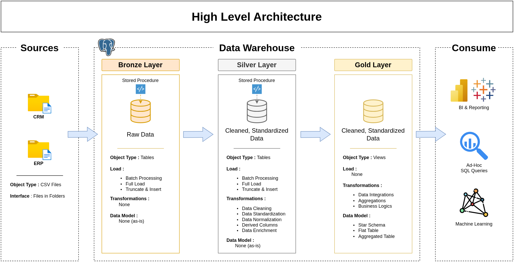

# Data Warehouse Project

Welcome to the **Data Warehouse Project** repository! 🚀

I created this project to continue improving my **Data Engineering** skills. The primary objective was to build a basic **data warehouse** that enables data to flow from a **Bronze layer** to a **Gold layer**. This allows me to work on **ingestion**, **transformation**, and **loading** processes to deliver quality data to Data Analysts, Data Scientists or Business Users.

Building this kind of simple architecture provides a better overall vision of data projects. It allows for **step-by-step progress** while continuously delivering results.

This project is inspired by the video [SQL Data Warehouse from Scratch from Data with Baraa](https://www.youtube.com/watch?v=9GVqKuTVANE&list=PLNcg_FV9n7qaUWeyUkPfiVtMbKlrfMqA8&index=1&pp=iAQB). I was able to follow his guidance and create my own Data Warehouse using the provided datasets, while adhering to the **best practices** he highlights.

---

## 🏗️ Data Architecture

This project follows a medallion architecture **Bronze**, **Silver**, and **Gold** layers:




1. **Bronze Layer**: Stores raw data as-is from the source systems. Data is ingested from CSV Files into SQL Server Database.
2. **Silver Layer**: This layer includes data cleansing, standardization, and normalization processes to prepare data for analysis.
3. **Gold Layer**: Houses business-ready data modeled into a star schema required for reporting and analytics.


---

## 📖 Project Overview

This project involves:

1. **Data Architecture**: Designing a Modern Data Warehouse Using Medallion Architecture **Bronze**, **Silver**, and **Gold** layers.
2. **ETL Pipelines**: Extracting, transforming, and loading data from source systems into the warehouse.
3. **Data Modeling**: Developing fact and dimension tables optimized for analytical queries.

#### Objective
Develop a modern data warehouse using PostgreSQL to consolidate sales data, enabling analytical reporting and informed decision-making.


#### Specifications
- **Data Sources:** Import data from two source systems (ERP and CRM) provided as CSV files
- **Data Quality:** Clean and resolve data quality issues prior to analysis.
- **Integration:** Combine both sources into a single, user-friendly data model designed for analytical queries.
- **Scope:** Focus on the latest dataset only; historization of data is not required
- **Documentation:** Provide clear documentation of the data model to support both business stakeholders and analytics teams

---

## 📂 Repository Structure
```
data-warehouse-project/
│
├── datasets/                           # Raw datasets used for the project (ERP and CRM data)
│
├── docker/                             # Docker configuration files for containerized environment
│   ├── postgres/                       # PostgreSQL container configuration
│   │   └── init_db.sql                 # Database initialization script (creates schemas and initial structure)
│   └── pgadmin/                        # pgAdmin container configuration
│       └── servers.json                # Pre-configured server connections for pgAdmin
│
├── docs/                               # Project documentation and architecture details
│   ├── data_architecture.drawio        # Draw.io file shows the project's architecture
│   ├── data_catalog.md                 # Catalog of datasets, including field descriptions and metadata
│   ├── data_flow.drawio                # Draw.io file for the data flow diagram
│   ├── data_model.drawio               # Draw.io file for data models (star schema)
│   ├── naming_conventions.md           # Consistent naming guidelines for tables, columns, and files
│
├── scripts/                            # SQL scripts for ETL and transformations
│   ├── bronze/                         # Scripts for extracting and loading raw data
│   ├── silver/                         # Scripts for cleaning and transforming data
│   ├── gold/                           # Scripts for creating analytical models
│
├── tests/                              # Test scripts and quality files
│
├── README.md                           # Project overview and instructions
├── LICENSE                             # License information for the repository
├── docker-compose.yml                  # Docker Compose configuration for PostgreSQL and pgAdmin services
├── .env.example                        # Template for environment variables (copy to .env and configure)
└── .gitignore                          # Files and directories to be ignored by Git

```

---

## 📋 Prerequisites

Before you begin, ensure you have the following installed:
- **Docker** (version 20.10 or higher)
- **Docker Compose** (version 2.0 or higher)
- **Git**
- Basic knowledge of SQL and PostgreSQL

---

## 💡 Quick Start

### 1. Clone the repository
```bash
git clone https://github.com/LeonPineau/data-warehouse-project.git
cd data-warehouse-project
```

### 2. Configure environment variables
```bash
cp .env.example .env
# Edit .env with your preferred credentials
```

### 3. Start the Docker services
```bash
docker compose up -d
```

### 4. Access pgAdmin
Open your browser and navigate to [http://localhost:5050](http://localhost:5050)

Login with the credentials you set in `.env`

### 5. Run the ETL scripts
Execute the SQL scripts in order:
```bash
# Connect to your database via pgAdmin, then run:
# 1. scripts/bronze/*.sql
# 2. scripts/silver/*.sql
# 3. scripts/gold/*.sql
```

### 6. Verify your data warehouse
Check that all layers (bronze, silver, gold) are populated correctly.

---

## 🧗 Future Enhancements

I'm continuing to develop this project with the goal of evolving the data engineering components.

I'll be working on it independently, but feel free to take the project and enhance it yourself:
- Improve traceability and transformations with **dbt**
- Orchestrate ingestion and transformations via **Airflow**
- Implement a logging system to monitor data warehouse health
- Analyze data using **Power BI**, **Tableau**, or **Streamlit**
- Automate the ingestion process

---

## 🛡️ License

This project is licensed under the [MIT License](LICENSE). You are free to use, modify, and share this project with proper attribution.

## 🌟 About Me

Hi there! I'm **Leon Pineau-Valencienne**, an aspiring data architect with a passion for data engineering topics. I hope you enjoy this training project!

Feel free to connect with me on [LinkedIn](https://www.linkedin.com/in/leon-pineau-valencienne/) or check out my other projects on [GitHub](https://github.com/LeonPineau).

[](https://www.linkedin.com/in/leon-pineau-valencienne/)
[](https://github.com/LeonPineau)